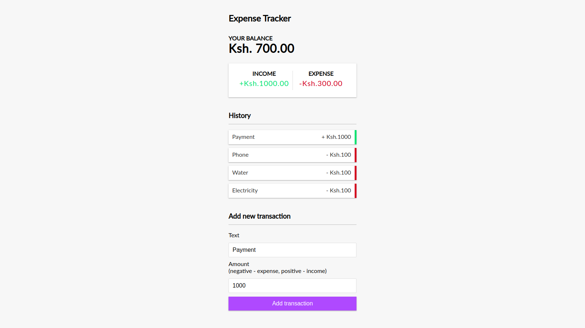

# Expense-Tracker

This is a simple expense tracker app made with React.

### Local Setup

To setup this project locally,

- Clone repo:

` git clone https://github.com/nickmwangemi/expense-tracker-react.git`

- Install dependencies:

`yarn `

- Run the dev server:

` yarn start`

Runs the app in the development mode. 
Open [http://localhost:3000](http://localhost:3000) to view it in the browser.

The page will reload if you make edits. 
You will also see any lint errors in the console.
